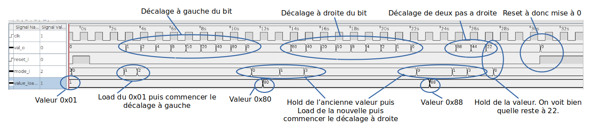
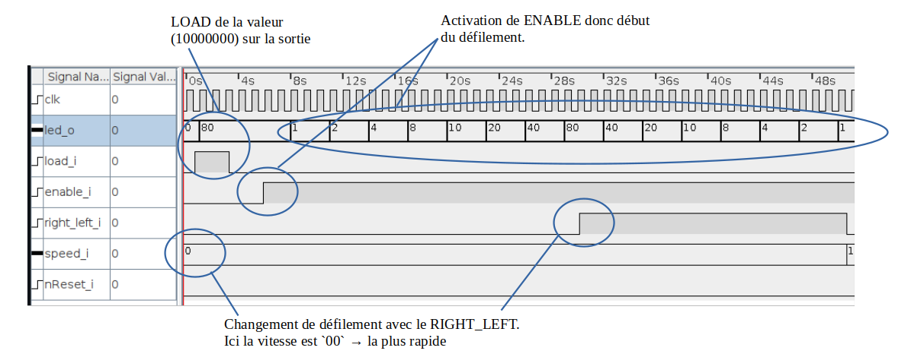
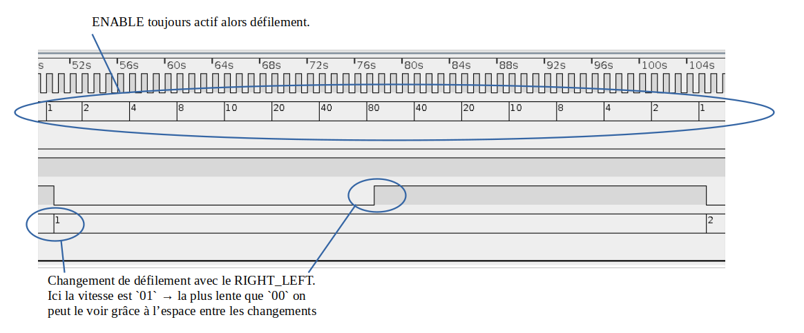
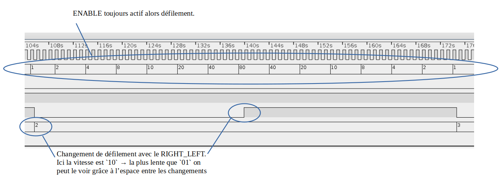
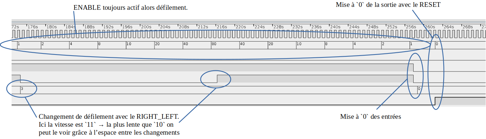

# Laboratoire Chenillard

**Groupe :** numéro 11

**Auteurs :** Piemontesi Gwendal, Trüeb Guillaume

**Date :** 23 novembre 2023

---

## QUESTION1

**Que se passerait-il si l’entrée clk_i d’un des composants n’était pas reliée au signal d'horloge ?**

Le composant ne changera jamais d'etat, donc il bloquera le registre à décalage. Ce qui veut dire qu'il ne fonctionnera donc plus.

## QUESTION 2

**Si l’on charge la valeur 0b0110 dans le registre, que les entrées ser_r_i et ser_l_i sont à 0 et que l’on effectue un décalage de 2 bits vers la droite, puis un décalage de 3 bits vers la gauche, quelle valeur va-t-on obtenir en sortie ? Démontrez les étapes pour obtenir votre résultat.**

Nous allons avoir la valeur 1000.

Lors-ce que l'on **LOAD** les valeurs **0b0110** celle-ci sont insérée dans notre registre à décalage de 4 bits. Ensuite il faut appliquer les décalages 2x à droite et 3x à gauche. Vu qu **ser_r_i** et **ser_l_i** sont à **0**, alors seront inséré à chaque décallage uniquement des 0.

|   Type décalage   | Valeur |
| :-----------------: | :----- |
|        LOAD        | 0110   |
| Décalage à droite | 0011   |
| Décalage à droite | 0001   |
| Décalage à gauche | 0010   |
| Décalage à gauche | 0100   |
| Décalage à gauche | 1000   |

## QUESTION 3

**Mettez en évidence les différentes étapes ci-dessus dans votre chronogramme.**

## QUESTION 4

**Votre circuit a-t-il le comportement attendu ? Argumentez et développez votre réponse.**

Oui le comportement du circuit semble bon !

Les différentes étapes spécifiées, telles que le chargement de valeurs prédéfinies et les opérations de décalage à gauche (SHL) et à droite (SHR), ont été exécutées avec succès.

Les valeurs chargées dans le circuit correspondent aux valeurs spécifiées dans les instructions.

Les décalages à gauche et à droite ont été réalisés conformément aux attentes, déplaçant les bits dans la direction et dans le nombre de positions requis.

Le mode HOLD a été testé après un décalage de deux pas vers la droite (SHR), et la valeur est restée inchangée, ce qui démontre le bon fonctionnement de ce mode.

Enfin, le reset asynchrone du système a été exécuté avec succès, réinitialisant le circuit de manière appropriée.

En considérant ces points, le circuit semble répondre correctement aux exigences et comportements attendus selon les instructions de la question 4.

## QUESTION 5

**Avec une fréquence d’horloge (clk_i) de 30MHz, calculez le nombre de cycle à attendre pour qu’il corresponde à une fréquence de 4, 2, 1 et 0.5 Hz et complétez le tableau ci-dessous avec le nombre de cycles visé en fonction la fréquence et l’équvalence encodée au format hexadécimal sur 28 bits (0xfffffff).**

| Fréquence visée | Nombres de cycles | Équivalence 28 bits hexadécimal |
| ----------------- | ----------------- | --------------------------------- |
| 4.0Hz             | 7'500'000         | 0x07270E0                         |
| 2.0Hz             | 15'000'000        | 0x0E4E1C0                         |
| 1.0Hz             | 30'000'000        | 0x1C9C380                         |
| 0.5Hz             | 60'000'000        | 0x3938700                         |

> **Attention** dans logisim faire -1 a la valeur en hexa car il y a le 0 !

## QUESTION 6

**Démontrez que le fonctionnement attendu est conforme en mettant en évidence les différents états sur votre chronogramme. Développez et argumentez votre réponse.**

Les valeurs des différentes vitesses ont été changées pour avoir un circuit exploitable par Logisim et lisible dans le chronogramme. De plus, dans cet exemple, un `reset` a été utilisé et non un `nReset` comme dans le circuit final.

